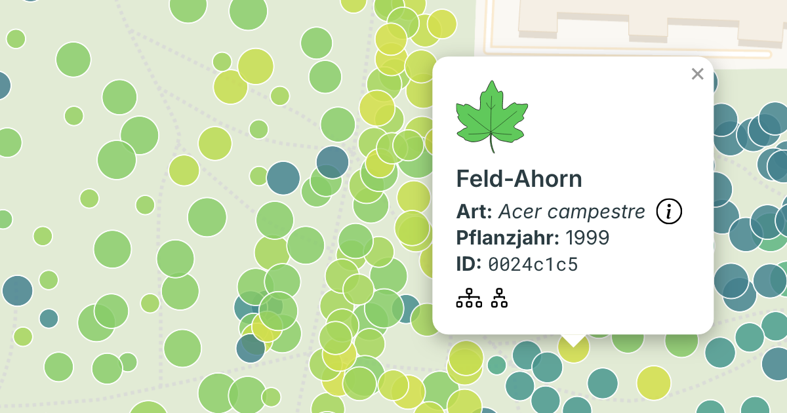

# From raw data to structured taxonomy: Berlin’s urban tree dataset

## Project overview
In this project I have built a clean, structured, and map-ready dataset of urban trees based on [public municipal data](https://www.berlin.de/sen/sbw/stadtdaten/geodaten-berlin/) from Berlin. 

While the raw dataset is generally of very high quality, it still contains several inconsistencies, such as incorrect taxonomy, inconsistent naming, and duplicate records, which makes it difficult to use directly in applications. This repository implements a pipeline to clean, normalize, and enrich the data, and to prepare it for use in an interactive online map. 

### What the project does

- Cleans and standardizes the raw data in R
- Builds a normalized relational database in PostgreSQL
- Outputs a dataset optimized for use in an interactive map
- Leaves an audit trail of changes made to the original data records

### Key design principles

- All naming logic is anchored in taxonomy
- R handles data cleaning and rule-based transformations
- SQL handles relational structure and derived views

### Interactive map

I used the cleaned and quality controlled dataset to develop a beautiful and user-friendly [interactive map](https://berlintreemap.de) using the MapLibre TypeScript library. The map is a handy tool for exploring the trees of Berlin.



## Data source
Data was downloaded from [GDI-BE](https://gdi.berlin.de/geonetwork/srv/ger/catalog.search#/metadata/48ad3a23-d974-3458-90b7-deb0d5941c0a) on May 11, 2026. Two files were downloaded, one for street trees (Strassenbäume) and one for park trees (Anlagenbaüme). The two datasets contain information about ~950,000 trees in Berlin. The original datasets, not included here, are licensed under `DL-DE-ZERO-2.0`.

The data was converted from `.gpkg` to `.csv` files in R using the `sf` package, including converting the coordinates to WGS84 format:

```R
df <- sf::st_read("raw_data/strassenbaeume.gpkg")
df |> 
    mutate(
        wgs84 = sf::st_transform(geom, 4326),
        lon = sf::st_coordinates(wgs84)[, 1],
        lat = sf::st_coordinates(wgs84)[, 2]
        ) |>
    select(-wgs84)
```

The contents of this repository (data cleaning code, validation rules, and correction methodologies) are licensed under `AGPL-3.0`.

## Data cleaning steps

### Standardization in R
- Check for duplicate IDs
- Flag entries with identical locations
- Check that year of planting is within an expected range
- Normalize hybrid markers (e.g. `x` to `hybr.`)
- Normalize cultivar quotes (e.g. `"` to `'`)
- Fix mistakes in scientific names (e.g. spelling, casing, diacritics, missing species epithet in cultivars, missing hybrid designations) according to [these](rules/latin_regex.csv) and [these](rules/latin_regex_malus.csv) rules

### Normalization in postgreSQL
- Separate scientific names into taxonomic components
- Build a normalized taxonomy (orders → families → genera → species → infraspecies) and enforce valid taxonomic structure through constraints
- Retain a single record per location based on data completeness (e.g. presence of taxon, planting year)

### Standardization of German common names
- Standardize common names according to [FloraWeb](https://floraweb.de) or other sources
- Implement common name resolution with fallback to parent taxon name when needed
- Define display rules (e.g. when to include cultivar names)

Fixing scientific names and German common names is work in progress.

All changes to the raw dataset are listed in the [changelog](output/changelog).


